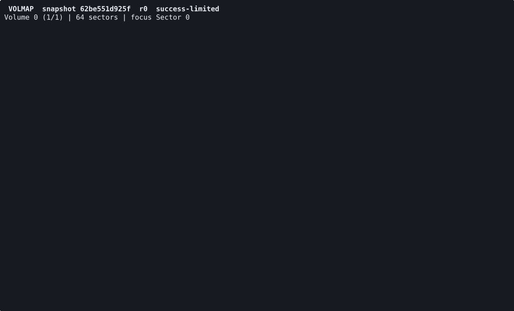
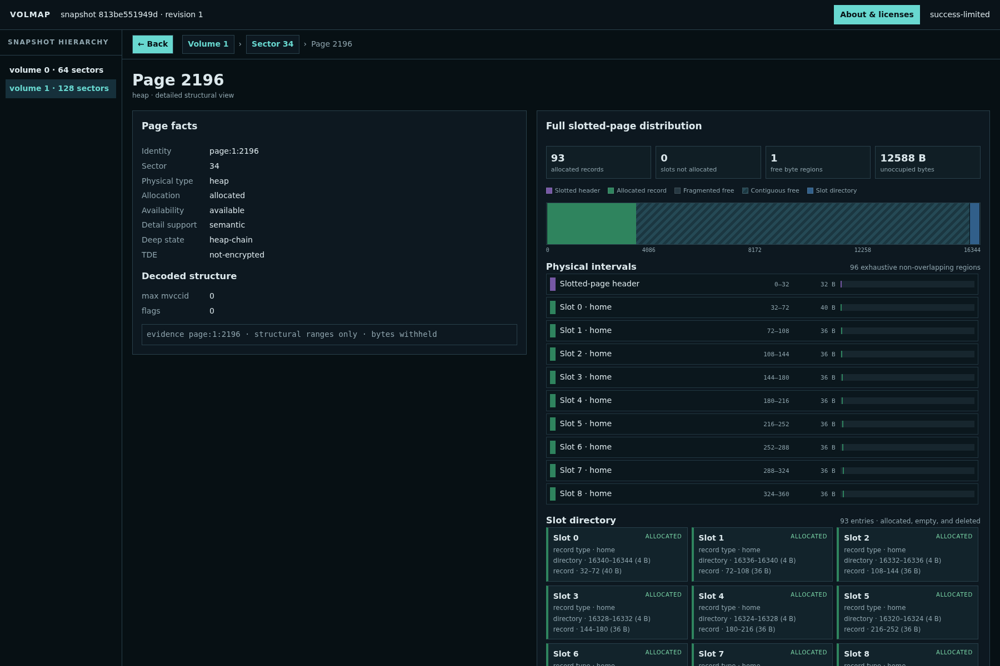

# Volmap

See what is inside a CUBRID volume without starting the database or changing a
byte.

Volmap turns an offline volume set into a navigable map of Volumes, Sectors,
Pages, Files, and records. Start with the terminal interface, query the same
facts from the CLI, or explore them in a browser.

## See it in action

### Terminal

Use the arrow keys to move, **Enter** to inspect, and **Esc** or **Backspace**
to return.



### Web

The browser viewer presents the same inspection facts with shareable entity
URLs and a full-volume mosaic.



## Quick start

The repository's `just` recipes pin Rust 1.97.1 and the frontend toolchain. The
supported release artifact is a static Linux x86-64 musl binary:

```sh
just build-release
```

Open a stopped database registered with CUBRID:

```sh
./target/x86_64-unknown-linux-musl/release/volmap tui --database demodb
```

Or inspect a copied volume set directly through its volume-info file:

```sh
./target/x86_64-unknown-linux-musl/release/volmap \
  tui --vinf /snapshot/demodb_vinf
```

Every command accepts exactly one of these inputs:

```text
--database NAME [--databases-file FILE]
--vinf PATH [--volume-root DIR]
```

## What can Volmap inspect?

- Volume geometry, Sector reservation, and Page allocation
- File ownership and Page-to-table association
- Slotted-page structure, free space, slots, and record layout
- Heap, B-tree, catalog, vacuum, OOS, and `REC_BIGONE` overflow metadata
- Validated relocation and overflow chains
- TDE-encrypted Pages when an explicit local key file is supplied
- Typed record values only when the operator explicitly selects that record

Unsupported, encrypted, malformed, or incomplete evidence remains visible as
a typed diagnostic. Volmap does not guess missing facts.

## Other ways to inspect

Get a quick human-readable summary:

```sh
volmap summary --vinf /snapshot/demodb_vinf --format human
```

Query a specific entity as JSON:

```sh
volmap inspect --vinf /snapshot/demodb_vinf page:0:129 --format json
```

Start the live web viewer on loopback:

```sh
volmap serve --vinf /snapshot/demodb_vinf --listen 127.0.0.1:8080
```

Or create a deterministic, self-contained HTML report:

```sh
volmap export html --vinf /snapshot/demodb_vinf --output report.html \
  --enrich page:0:129
```

Selectors use nonnegative decimal identifiers:

```text
volume:VOLID
sector:VOLID:SECTORID
file:VOLID:FILEID
page:VOLID:PAGEID
slot:VOLID:PAGEID:SLOTID
oos:VOLID:PAGEID:SLOTID
```

## Safety and scope

- Volmap is read-only. It never repairs or writes a CUBRID volume.
- Finite commands require a stopped database, immutable snapshot, or stable
  copy. If an input changes during inspection, Volmap invalidates the snapshot.
- `serve` follows on-disk changes by default. It reports observed disk state,
  which is not the same as transactionally committed database state. Use
  `--no-follow` for one immutable reading.
- Raw application bytes, ciphertext, and TDE secrets never appear in output.
  Decoded values appear only for explicitly selected records.
- The web server has no built-in authentication. Keep it on loopback or place
  remote access behind SSH, a VPN, firewall, or trusted TLS reverse proxy.
- This project is under active development and currently targets the CUBRID
  `feat/oos` volume format at commit
  `e1e651debf6cc100172bde96603b17424f9c135a`.

The disclosure policy is documented in
[ADR-0001](docs/adr/0001-explicit-target-disclosure.md). See
[CONTEXT.md](CONTEXT.md) for the project vocabulary and
[docs/](docs/) for format contracts, design decisions, and research notes.

## Development

Run the complete local gate before submitting a change:

```sh
just verify
```

After changing `web/src/`, regenerate the committed frontend artifacts with
`just vite::frontend-generate-artifacts`. The `just verify` gate includes
`just frontend-check`.

To regenerate the TUI GIF from a repository-controlled fixture, install
`asciinema`, `agg`, and `expect`, then run:

```sh
docs/recordings/record-tui-demo.sh
```

Run `volmap licenses` to print the embedded project and dependency notices.
