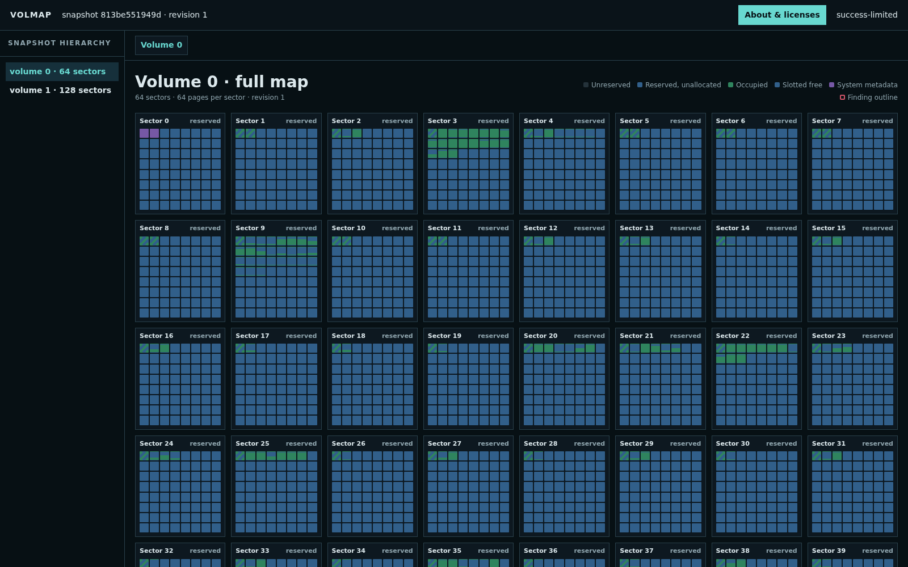
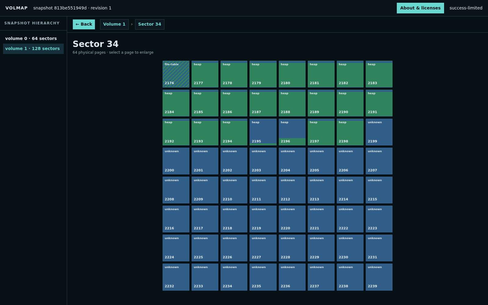

# Volmap Inspector

Volmap is a read-only offline inspector for the CUBRID `feat/oos` physical
volume format pinned at commit `e1e651debf6cc100172bde96603b17424f9c135a`.
It produces structural and allocation facts, and never returns raw page or
record bytes. Decoded attribute values are shown only for records an operator
explicitly asks it to interpret, under the disclosure rule in
[ADR-0001](docs/adr/0001-explicit-target-disclosure.md).

The implementation is under active development. Plaintext fast scans, volume
and sector maps, explicit file allocation maps, slotted-page inspection
(including role-gated E-hash buckets), OOS and `REC_BIGONE` overflow-chain
validation, heap header/chain metadata, caller-proven value-free heap object
envelopes (including MVCC header structure), validated same-heap relocation
edges, record interpretation against the class object's own representation
(attribute names, domains, typed values, and the record's byte layout),
vacuum metadata, structural B-tree
root/node/OID-overflow metadata, validated catalog directory/class/representation
metadata, terminal browsing,
deterministic HTML export, and the live web viewer are usable. TDE
decryption is available from an explicit local key file and applies to every
deep page read. The pinned source-derived acceptance corpus covers the current
semantic page families. Fast page facts use an exact 16-byte canonical form and
automatically move to private, unlinked spill storage under the resident-memory
budget. Bounded envelope workers merge facts and findings back into canonical
physical order. The remaining mutation/fuzz, distribution, and company release
approval matrices are still release gates.

## Screenshots

### Volume map



### Sector drill-down



### Slotted-page inspection


## Build

The supported release target is static Linux x86-64 musl:

```sh
cargo build --release --locked --target x86_64-unknown-linux-musl
```

The resulting executable is
`target/x86_64-unknown-linux-musl/release/volmap`.

## Inputs and selectors

Every inspection command takes exactly one input:

```text
--database NAME [--databases-file FILE]
--vinf PATH [--volume-root DIR]
```

Selectors are canonical nonnegative decimal identifiers:

```text
volume:VOLID
sector:VOLID:SECTORID
file:VOLID:FILEID
page:VOLID:PAGEID
slot:VOLID:PAGEID:SLOTID
oos:VOLID:PAGEID:SLOTID
```

## Examples

```sh
volmap summary --vinf /snapshot/db_vinf --format human
volmap map --vinf /snapshot/db_vinf --format json
volmap map --vinf /snapshot/db_vinf file:0:128 --format json
volmap inspect --vinf /snapshot/db_vinf page:0:129 --format human
volmap inspect --vinf /snapshot/db_vinf oos:1:2243:0 --format json
volmap tui --vinf /snapshot/db_vinf
volmap export html --vinf /snapshot/db_vinf --output report.html \
  --enrich page:0:129 --enrich oos:1:2243:0
```

`human`, `json`, and `jsonl` finite outputs share the same inspection graph.
Machine output includes snapshot identity, revision, validity, coverage,
outcome, and diagnostics. It omits input paths and source bytes. It carries
decoded attribute values only for records that were explicitly interpreted.

## Web access

Loopback is the default, and the browser opens the inspection directly without
a credential prompt. `serve` follows the input by default: it watches the data
volumes and publishes a new snapshot generation after their on-disk state
changes.

```sh
volmap serve --vinf /snapshot/db_vinf --listen 127.0.0.1:8080
```

The browser long-polls for generations and re-renders the current drill level
without adding a history entry. Its header distinguishes when Volmap read the
input from when the newest data volume changed on disk, and Pause freezes the
display while still reporting a newer observed generation. Live URLs name an
entity rather than a generation, so a copied volume, sector, page, slot, or OOS
URL continues to resolve after later generations replace the one that first
produced it. Generation, revision, validity, observation time, and input disk
time remain explicit in every JSON envelope.

To hold one immutable reading instead, use `--no-follow`. A changed input then
invalidates the session exactly as it does for the finite commands. The watcher
poll interval and the retained generation window can be tuned when needed:

```sh
volmap serve --vinf /snapshot/db_vinf --no-follow
volmap serve --vinf /snapshot/db_vinf \
  --follow-interval-ms 500 --follow-retain 4
```

From another machine, forward the loopback listener through SSH:

```sh
ssh -L 8080:127.0.0.1:8080 user@server
```

To accept remote clients, explicitly listen on all IPv4 interfaces:

```sh
volmap serve --vinf /snapshot/db_vinf --listen 0.0.0.0:8080
```

After binding, `serve` prints a sorted, deduplicated list of copyable URLs for
the active local IPv4 interfaces. Loopback-only listeners print their single
reachable URL.

This mode is deliberately unauthenticated: anyone who can reach the port can
inspect metadata and request bounded enrichment. Use a firewall, SSH, a VPN, or
a trusted TLS reverse proxy when the network is not fully trusted. Binding a
specific non-loopback address or the IPv6 wildcard is rejected; remote access
must be the explicit `0.0.0.0:PORT` form.
The volume workspace renders a progressively loaded full-volume mosaic: every
sector is an 8×8 grid of its 64 pages. Allocated slotted pages split green
occupied space from blue free space using an eager header summary; pages whose
occupancy cannot be established use a green/blue unknown pattern. Allocation
classes remain distinct, and findings are shown as a separate outline.
Selecting a sector replaces the mosaic with a large 64-page view. Selecting a
page replaces that sector with detailed structural facts. Slotted pages show an
exhaustive 16,344-byte content distribution: the slotted header, every allocated
record extent, every fragmented or contiguous free interval, and the complete
slot directory. Directory entries are colored and labeled as allocated,
unallocated, or deleted, with record and directory offsets and sizes shown
separately. Every volume, sector, page, slot, and OOS view has a canonical live
entity URL. Browser Back and Forward restore those entities at the generation
currently on display; reloading a deep URL restores the same drill level
directly. Enrichment stays on that URL and is re-issued after a generation
advance when a slot or OOS view depends on it. Use `export html` when the
artifact must freeze one immutable revision. Breadcrumb and Back controls
return to the preceding level.

### Local React viewer development

The live React application is compiled into the committed
`src/web/generated/frontend.js` and `frontend.css` assets. Cargo embeds those
files in the Volmap executable, so every `serve` invocation uses the React
viewer without running Node or Vite at startup.

Use the user-level recipes to regenerate the frontend and then run `demodb`:

```sh
# Debug build
just user::serve-debug-demodb

# Optimized static-musl release build
just user::serve-release-demodb
```

Both recipes listen on port 7777; open `http://127.0.0.1:7777`. They compose a
frontend generation primitive with a Rust serve primitive:

```text
user::serve-debug-demodb
  ├─ vite::frontend-generate-artifacts
  └─ cargo::serve-debug-demodb
```

Maintainers can invoke those lower-level namespaces independently. To serve the
currently generated bundle with custom debug arguments, use for example:

```sh
just cargo::serve-debug --database demodb --listen 127.0.0.1:8080
```

Cargo does not rebuild the frontend source. After changing files under
`web/src/`, regenerate the embedded assets before starting or rebuilding the
server:

```sh
just vite::frontend-generate-artifacts
just cargo::serve-debug-demodb
```

Run `just vite::frontend-check` before committing frontend changes. It checks types,
unit tests, deterministic generated assets, dependency advisories, Chromium and
Firefox behavior against the actual Rust server, and Cargo-only embedding.
There is currently no supported Vite hot-reload server; the integration path
always exercises the Rust server and its embedded bundle.

The previous top-level names remain compatibility aliases: `serve-debug-demodb`
and `serve-release-demodb` delegate to the corresponding `user::` recipes,
while `frontend-artifacts` delegates to
`vite::frontend-generate-artifacts`.

## Safety and scope

- Finite commands and `serve --no-follow` use the immutable contract. Run them
  against a stopped database, immutable snapshot, or copy; an input change
  invalidates their snapshot.
- Default `serve` is intended to follow a changing input, but it reports
  observed disk state, not transactional committed state. A committed change
  is invisible until the engine flushes the affected data volume, while a page
  written before commit may already be visible.
- The tool never repairs or writes a CUBRID volume.
- Deep decoding is selective and resource-bounded. A stopped boundary is
  represented in coverage and diagnostics rather than silently sampled.
- Raw application payload bytes, ciphertext, and TDE secrets are outside every
  output surface. Decoded attribute values appear only for records explicitly
  interpreted, and a value that cannot be decoded is reported as a typed
  placeholder naming its type, extent, and reason — never as bytes or hex.

## Resource defaults

Version-one internal defaults are a 256 MiB admitted resident limit, 2 GiB
private spill limit, four envelope workers, 16,384 chain steps, and 256 MiB of
decoded input per explicit operation. The limits are hard admission boundaries,
not preallocations. Reaching one publishes the validated prefix with partial
coverage and never silently samples.

The deterministic reference-host matrix covers small, medium, large, 4 GiB
sparse, fully reserved, corruption-heavy, resident/spilled, cancellation, query,
and 512-chunk OOS profiles. Run it with `just resource-benchmark`. Its timings
are engineering evidence, not a device-independent performance SLO; cold-cache,
constrained-host, and cross-distribution runs remain release checks.

Run `volmap licenses` for the embedded project notice. The complete decision
and acceptance specification is in
`.scratch/volmap-inspector/implementation-spec.md`.
